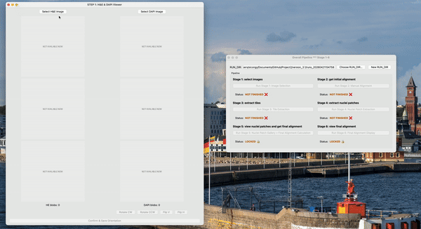

## PHARAOH (Beta version 3.2)

### ⚠️ Now please only test on Xenium data. Refinement is needed for other platforms.

PHARAOH is a scalable and generalizable framework for multimodal tissue image alignment and spatial transcriptomics enhancement.

It enables fast, robust, GUI-based, and GPU-free semi-automatic registration between DAPI imaging from multiplexed imaging platforms (Xenium, CosMx, Orion, CODEX, CycIF), and histology (H&E), supporting both same-section and adjacent-section alignment.


## 📂 Required Input Files

In order to run the PHARAOH platform, you will need the following files:

1. An image containing one DAPI/DNA channel (should be on the first channel if of multi-channels), in the format of `.ome.tif`, `.tif` or `.jpg`. 

    The DAPI file from Xenium platfrom typically is in the format of either `morphology_focus.ome.tif` or `morphology_focus/morphology_focus_0000.ome.tif`
2. An H&E image from the same slice or an adjacent slice in the format of `.ome.tif`, `.tif` or `.jpg`. 
3. (Optional) A `cells.csv.gz` containing cell centroids information for visualization purpose for Xenium platform.

In order to achieve the best alignment performance, please consider using raw, unscaled images.

---

## ⚙️ Setup

First, clone the repository:

```bash
git clone https://github.com/yaosicong1999/PHARAOH.git
cd PHARAOH/version_3.2
```

We recommend installing PHARAOH in a dedicated Conda environment.
Install using:
```bash
bash install_conda_env.sh
```

Typical installation time is approximately 5 minutes on a standard desktop with internet access, depending on network speed and package resolution.

Then simply:
```bash
conda activate PHARAOH
```
### Tested environments
PHARAOH has been tested on MacOS 15.7.3 (Rosetta x86); MacOS 15.7.5 (Rosetta x86); MacOS 15.7.3 (Arm64).

---


## 🚀 Usage

For parameter controls, please see the later subsection. 
### Overall control panel

To launch the overall control panel, just:
```bash
python 0_pipeline.py
```

In order to create a new run attempt, click the `New RUN_DIR` button on the top-right corner. This will create a run folder in the format of `/Current folder/runs_YYYYMMDDHHMMSS/`.

If you want to load a previous existing run attempt, please click `Choose RUN_DIR` button. Please note that the run folder should be in the format of  `/runs_{some_integer_ID}/`.


Please note that the following steps may need a long time (~1 to 2 mins) to load dependecies for the first time use after opening the control panel for the first time.

### Stage 1: Select H&E image and DAPI image
Simply click the `Stage 1` button in the control panel.

Then, in the viewer:

- Click `Select H&E Image`
- Click `Select DAPI Image`

Large `.tif` or `.jpg` files may take longer to load due to reading and downsampling. `.ome.tif` files typically load within a few seconds.

#### Adjust Visualization

After loading both images, use the two `threshold sliders` to adjust:
  - The *H channel* visualization for the H&E image (displayed in the second row, visualization only)
  - The *LUT-colored* DAPI image (displayed in the second row)

For the DAPI image:

> Ensure the LUT-colored image is clearly visible but not overly saturated or patchy.  
> Proper visualization at this stage will make subsequent alignment steps easier and more reliable.

#### ⚠️ Required: Match Orientation

Before proceeding:

- Use the `Rotate` and `Flip` buttons in the DAPI column  
- Match the DAPI image orientation to the H&E image

This step is mandatory.


#### Save Image Paths and DAPI Orientation

Once everything looks correct, click `Confirm & Save Orientation`.

#### Demo
<p align="center">
  
</p>

#### Output

After completing Stage 1, the following outputs will be generated:

> - `images_info.json`
> - PNG images prefixed with `1_`

---

### Stage 2: Get Initial Alignment

Simply click the `Run Stage 2B: Manual Alignment` button in the control panel.  
(`Run Stage 2A: Blob Matching` is currently suspended.)


#### Adjust View Size
Press `Control` and `+` or `-` at the same time to adjust the view size.


#### Alignment Modes

By default, the alignment mode is set to `Mode: Affine`

Under `Mode: Affine`, you can:

- Drag any blue corner to scale the floating DAPI image.
- Hold the `Shift` key while dragging a blue corner to scale the image proportionally (diagonal scaling).
- Drag the floating DAPI image to move it.
- Hold / release the `Control` key to hide or reveal the floating DAPI image.

Once the approximate size and position are matched, click the  
`Mode: Affine` button to switch to `Mode: Perspective`.

Under `Perspective mode`, you can:

- Drag any blue corner to stretch or distort the floating DAPI image.

> ⚠️ Rotation has not been implemented as a standalone function yet.  
> To simulate rotation, use `Perspective mode` adjustments.

#### Loading Existing Alignment

To load a previously saved manual alignment:

1. Click `Load H (.json)`.
2. Select the transformation matrix file.

> ⚠️ The transformation must correspond to the same pyramid level specified in `images_info.json` from Stage 1.

#### Saving Alignment

Once alignment is satisfactory, click `Save Alignment` at the bottom of the viewer.

#### Demo
<p align="center">
  
</p>

#### Output

After completing Stage 2, the following outputs will be generated:

> - `manual_initial_alignment.json`
> - PNG images prefixed with `2_`

---

###  Stage 3: Extract Tiles

Simply click the `Stage 3` button in the control panel to open the tile gallery.

#### Available Controls in the Step 3 Viewer
There are three buttons in the Step 3 viewer:

1. `Sample Tile Centroids`  
   Samples tile centroids based on the parameters defined in `parameters.json`.  
   If the requested number of tiles or tile size would result in oversampling of the image space, the algorithm will automatically reduce the number of sampled tiles to avoid excessive overlap.

2. `Tile Pilot Examination`  
   Extracts 10 pilot tiles from the sampled tiles for quick parameter tuning.

   You can adjust:
   - `DAPI masking offset`  
     - Positive values → smaller nuclei regions  
     - Negative values → larger nuclei regions  
   - `H&E intensity threshold (range: 0–1)`  
     - Higher values → larger nuclei regions  
     - Lower values → smaller nuclei regions  

   These parameters will be saved and applied in the main nuclei masking step.

   ⚠️ This step is optional for in-sample Xenium registration, but strongly recommended for adjacent-section registration.  

3.` Extract Current Tiles`  
   Extracts all sampled tiles based on the sampled centroid locations.

#### Demo
<p align="center">
  
</p>

#### Output

After completing Stage 3, the following outputs will be generated:

> - `sampled_points.json`
> - `tiles/` directory
> - `pilot_tiles/` directory (if pilot examination was performed)
> - PNG images prefixed with `3_`

---

### Stage 4: Extract Nuclei Patches

Simply click the `Stage 4` button in the control panel to open the tile gallery.

#### Available Controls in the Step 4 Viewer
There are six buttons in the Stage 4 viewer:

1. `Previous / Next / Refresh`  
   Navigate to the previous or next tile, or refresh the tiles and masks in the gallery.

2. `Run Nuclei Masking`   
   Generates nuclei masks for each DAPI tile and each H&E tile.

3. `Run Standout Nuclei Detection`  
   Aligns the DAPI nuclei mask and H&E nuclei mask for each tile pair (after masking is completed for all tiles).  

   - For high-quality Xenium data, this step typically identifies multiple standout nuclei as anchor points.  
   - For lower-quality Xenium data or adjacent tissue slices, it may not detect enough standout nuclei. In such cases, if the mask pair still yields a reasonable global alignment, the aligned tile centers will be used as anchor points instead.  

   This step usually takes approximately 3–5 minutes.

4. `Run Nuclei Patch Cropping`  
   Extracts paired DAPI and H&E patches based on the detected standout nuclei or aligned centers.

#### Demo
For demonstration purposes, this example uses only 20 selected tiles, though the number of tiles can be easily adjusted. See the **Parameter Controls** section for details.

<p align="center">
  
</p>

#### Output

Stage 4 generates an output folder `nuclei patches`.

---

###  Stage 5: View Nuclei Patches and Get Final Alignment
Click the `Stage 5` button in the control panel to open the nuclei patch gallery.

This viewer displays the extracted nuclei patches (or patches centered at the aligned centroids) for both DAPI and H&E images, allowing visual inspection. 

You can click any image to enlarge either image.
> ⚠️ **Note:** This feature is a test version.
> 
> 1. In the enlarged view, you can click on the image to propose refined keypoints. Press `Enter` to save the refined point.
> 2. If refined keypoints are presented, press 'Delete' to drop the refined points.
> 

#### Available Controls in the Step 5 Viewer
There are five buttons in the viewer:

1. `Previous / Next`  
Navigate between nuclei pairs.
2. `Calculate alignment matrix`  
Computes the final alignment matrix using the currently available keypoints (centroids).
The result is saved as: `dapi_to_he_homography_level0.json`
3. `Hide / Unhide auto centroids`   
Toggle the visibility of automatically detected centroids in each image.
4. `DAPI: LUT / Raw`
Switch between LUT-colored DAPI visualization and DAPI intensity image.
5.  `Drop patch pair`
Drop the current nuclei patch pair from the candidate list.

#### Demo
<p align="center">
  
</p>

#### Output
After clicking `Calculate alignment matrix`, Stage 5 generates `dapi_to_he_homography_level0.json`.  
This file contains the final homography matrix mapping DAPI (level 0) coordinates to H&E (level 0) coordinates.

---

### Stage 6: View Final Alignment

Click the **Stage 6** button in the control panel to open the final alignment gallery.

#### Available Controls in the Step 6 Viewer

There are three buttons in the viewer:

1. `Load Keypoints + Alignment Matrix`  
   Loads the keypoints onto both the DAPI and H&E images and generates the overlay visualization.

2. `Toggle H&E / Overlay `   
   Switches between:
   - H&E image only  
   - H&E image with DAPI overlay  

3. `Load Cell Data (cells.csv.gz)`  
   Loads cell data (for the Xenium platform) and overlays cell centroids on the H&E image for visualization.

#### Demo
<p align="center">
  
</p>

#### Output

After completing Stage 6, the following outputs will be generated:

- PNG images prefixed with `6_`
- GIF images prefixed with `6_`

We don't need a super-fine manual initial alignment to achieve pixel-accurate final alignment.
<p align="center">
  
</p>


---

## 🕹️  Parameters controls
Parameter config file `parameters.json` controls key behaviors of the PHAROAH pipeline across stages 3–5, including tile sampling, nuclei extraction, patch generation, and final transformation estimation. ***Italic*** parameters are relatively important.

####  🧩 Stage 3 — Tile Sampling
Controls how image tiles are sampled for downstream processing.
	
- ***n_tiles***: Number of tiles sampled from the whole slide image.
- ***tile_size***: Size (in pixels) of each sampled tile.
- **min_dist_factor**: Controls spatial dispersion of tiles. Larger values enforce more separation between tiles.
- **dapi_level_override / he_level_override**: Optional pyramid level override for DAPI / H&E images. Use "None" to automatically select levels.
- **he_tile_margin_ratio**: Additional margin (relative to tile size) added when extracting H&E tiles.
Helps ensure context coverage for cross-modality matching.


####  🧬 Stage 4A — Nuclei Mask Extraction

Controls preprocessing and segmentation of nuclei masks from DAPI and H&E.

**DAPI-related**
- **dapi_thr_offset**: Intensity threshold offset applied during binarization.
- **dapi_mask_min_area_factor**: Minimum nucleus area as a fraction of patch size.  Used to filter small noisy components.
- **dapi_mask_upscale_factor**: Upscaling factor applied to DAPI masks for higher-resolution refinement.

**H&E-related**
- **he_mask_n_smooth**: Number of smoothing iterations applied before thresholding.
- **he_mask_intensity_threshold**: Threshold used to segment nuclei-like regions from H&E.
- **he_mask_upscale_factor**: Upscaling factor for H&E masks.


####  🔍 Stage 4B — Tile Matching & Global Initialization

Controls how corresponding tiles are selected and aligned.

**Tile filtering**
- ***good_nuclei_min***: Minimum number of nuclei required for a tile to be considered valid.
- ***min_good_tiles***: Minimum number of valid tiles required to proceed.
- ***fallback_score_thr***: Threshold used when fallback matching is triggered.
- ***min_fallback_tiles***: Minimum number of tiles required in fallback mode.

**Pair selection**
- ***pair_top_k***: Number of best candidate matches per tile.
- ***pairs_to_take_per_tile***: Number of pairs retained per tile for alignment.

**Multi-stage alignment search - Phase 1 (coarse search)**
- **n_tiles**: Number of tiles used in coarse alignment.
- **ds**: Downsampling factor for speed.
- **scale_min, scale_max, scale_step**: Range and step size for scale search.
- **shift_frac, shift_step_frac**: Range and step size for translation search (relative to image size).

**Multi-stage alignment search - Phase 2 (refinement)**
- **median_scale_frac**: Scale refinement around median estimate.
- **scale_step**: Step size for scale refinement.
- **shift_frac, shift_step_frac**: Translation refinement parameters.

**Multi-stage alignment search - Phase 3 (fine refinement)**
- **scale_range_frac, scale_step_frac**: Fine-scale search range and resolution.
- **shift_range_frac, shift_step_frac**: Fine translation search parameters.

####  🔬 Stage 4C — Patch Extraction

Controls high-resolution local refinement patches.
- ***dapi_patch_len***: Patch size (in pixels) for DAPI-centered regions.
- **Other parameters (same as Stage 4A)**: Control mask extraction within patches.

#### 🧠 Stage 5 — Final Transformation Estimation

Controls how the final global alignment is computed.
	
- ***transform_mode***:
Type of transformation model.
  - "affine" — linear transformation (rotation + translation + scaling)
  - "homography" — projective transformation (default)
  -  "tps" — thin-plate spline (nonlinear)
  - "local_tps" — locally adaptive TPS (future/advanced use)

- ***balance_points_bool***: Whether to apply spatially balanced sampling before fitting.
   - false → use all nuclei pairs
   - true → grid-based sampling to avoid spatial bias